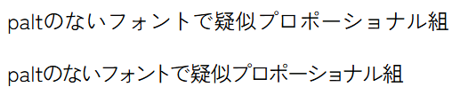

# add-pseudo-palt

A script to add pseudo-proportional width adjustment (palt) feature to font files.



## Features

- Applies proportional width adjustment only to specified codepoints
- Allows control of adjustment strength through a factor parameter
- Adds a "palt" feature to the font's GPOS table

## Usage

```
$ python add-pseudo-palt.py <input_font> <output_font> <factor> <codepoints_file>
```

### Arguments

- `<input_font>`: Path to the original font file
- `<output_font>`: Path to the output font file
- `<factor>`: Adjustment strength factor (recommended range: 0.0 to 1.0)
- `<codepoints_file>`: Path to a file containing the target codepoints

### Codepoints File Format

The codepoints file should be formatted as follows:

```
0x3000,0x3001,0x3002,0x3003-0x3007
```

- Codepoints are comma-separated
- Ranges can be specified using "-"
- Both decimal and hexadecimal (with 0x prefix) values are supported
